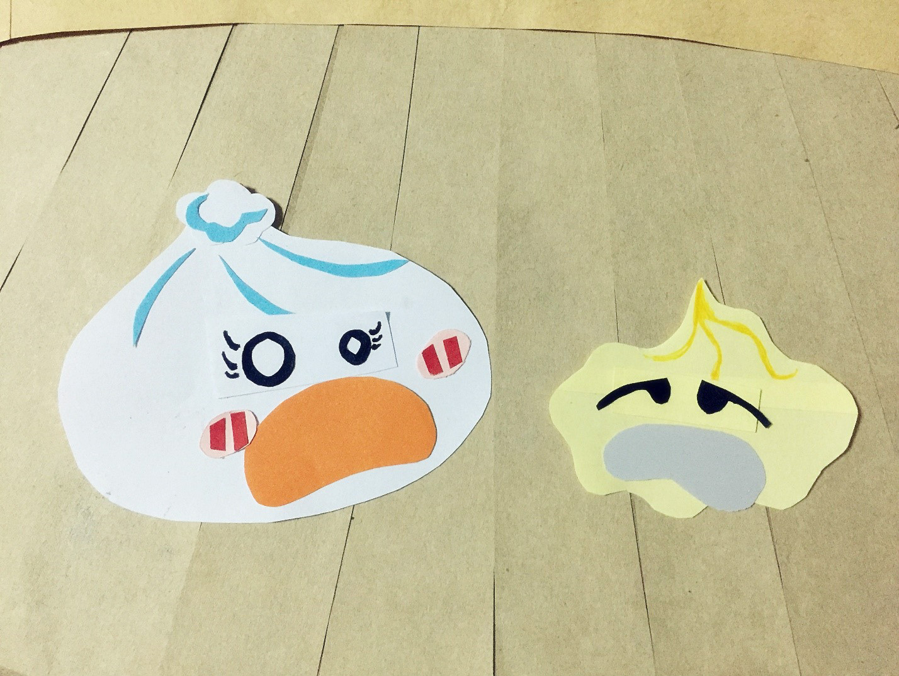

In a Mantou steamer, there are many different kind of mantous; White mantou, Pumpkin mantou, Cream mantou, Whole wheat mantou......and one of the mantous is stuffed, so everybody calls her 'Baozi'. The peaceful Mantou steamer gets excited because of the existence of Baozi. 

White mantou really likes Baozi, maybe because Baozi is different from other mantous. Every time Baozi talks, he can smell some fragrance; the fragrance that lifts out from Baozi's stuffing.

Baozi doesn't like White mantou, she only treats White mantao as a friend. Baozi wants to meet a Dimsum that she can see his stuffing while they are talking. Baozi wants to get out of the steamer to see the dining table and other different Dimsum. Baozi believes that she will definitely meet that Dimsum. 

Xiaolongbao comes to the steamer, Baozi is attracted by Xiaolongbao's meat juice that is always flowing out and the fragrance that comes along with the meat juice. She has never seen a Dimsum that has so much stuffings, with fresh fragrance and not oily. Baozi falls in love with Xiaolongbao, Xiaolongbao also sees the difference of Baozi amid all the mantous. Xiaolongbao likes to talk with Baozi, he is wondering what kind of stuffing Baozi has under her dough, but the more he gets to know her, the more he feels confused. 

Soon, Baozi finds out that Xiaolongbao is just a little thing made of mixed meat and vegetables, his thin dough can't withhold his overfilled stuffing, so the juice keeps spilling out, finally he has no more juice, and the fragrance is gone. 

Sometimes Baozi thinks that the fresh fragrance she smelled from Xiaolongbao is something she imagined by herself. So, her love relationship has ended. But, her love hasn't ended. She is still waiting the Dimsum that is her destiny. 

Siu Mai comes to the steamer, all the Dimsum here is now attracted by the colorful clothes of Siu Mai, many mantous gradually fall for the dough of Siu Mai. However, a few mantous defend Baozi, they suspect that Siu Mai doesn't have stuffing under her colorful clothes. 

Siu Mai boasts that she is stuffed by the fresh shrimps from the big ocean, but when mantous ask her what the ocean likes, she can't come up with an answer. Siu Mai can only admit that the shrimps under her dough are raised from the aquafarm, have never seen ocean before. After that, mantous also find out that there is flour mixed in Siu Mai's stuffing. Nonetheless, mantous still prefer the small and exquisite body of Siu Mai. After Siu Mai has arrived here, mantous start to feel that Baozi is a bit heavy. 

Dumpling comes to the steamer, mantous are now more sure that small and exquisite is the standard for a delicious Dimsum. Mantous like Dumpling, eventhough Dumpling doesn't have a colorful clothes, but she is the only one that has transferred a plain dough into a lovely dress. Also, through Dumpling's dress, mantous can see the stuffing inside faintly, therefore, no one has doubted that Dumpling really has stuffing or not. 

Mantous are now arguing about who is the most delicious Dimsum, so they had a vote. 

The vote result is 10 for Dumpling, 10 for Siu Mai, and 1 for Baozi. Mantous start to get angry, they think Baozi voted for herself. Therefore, mantous force Baozi to withdraw from voting, and then start a new vote. 

At the moment, the cap of the steamer opens, a pair of eyes roll through, and then a big hand enters the steamer and takes out Dumpling, Siu Mai, Xiaolongbao, and Baozi.

The Mantou steamer finally resumes its peace. 

